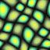

# Texture Synthesis #




This is the (latest?) texture synthesis code I wrote around 2014.
The goal is simplicity, quality, and flexibility/extensibility, so I have not attempted to incorporate the state-of-art algorithms or to optimize memory or speed.

## Method ##

As a combination of multi-resolution (Fast Texture Synthesis using Tree-structured Vector Quantization, SIGGRAPH 2000), k-coherence (Synthesis of Bidirectional Texture Functions on Arbitrary Surfaces, SIGGRAPH 2002), and randomized search (PatchMatch: A Randomized Correspondence Algorithm for Structural Image Editing, SIGGRAPH 2009), this is a very simple and yet effective texture synthesis method without requiring any training or large neural networks as in recent deep learning methods (see Image Style Transfer Using Convolutional Neural Networks, CVPR 2016, and the follow up works), which are more suitable for style transfer or other advanced applications.

## Build ##

Go to the build folder, and 

```
cmake ..
cmake --build . --config Release
```

## Run ##

Make sure [magick](https://www.imagemagick.org/) is under your path.

Under the build folder, run
```
python ./bin/test.py
```
, and see the input and output under the data folder.
